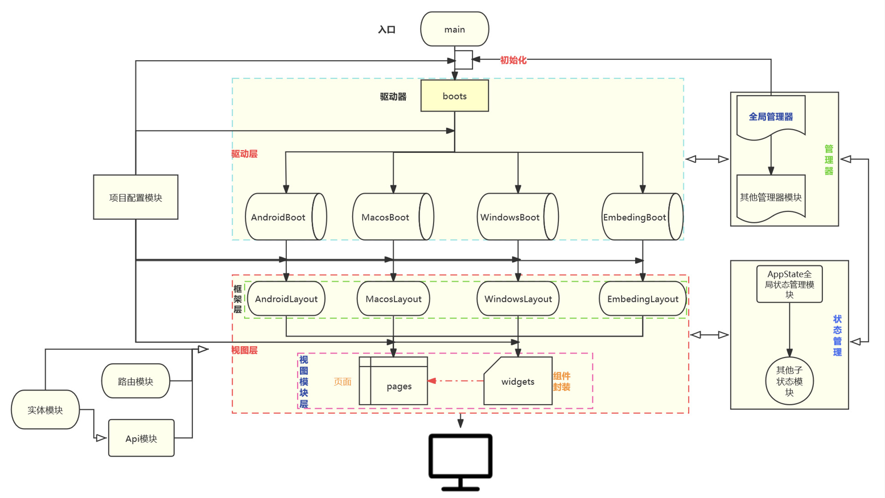
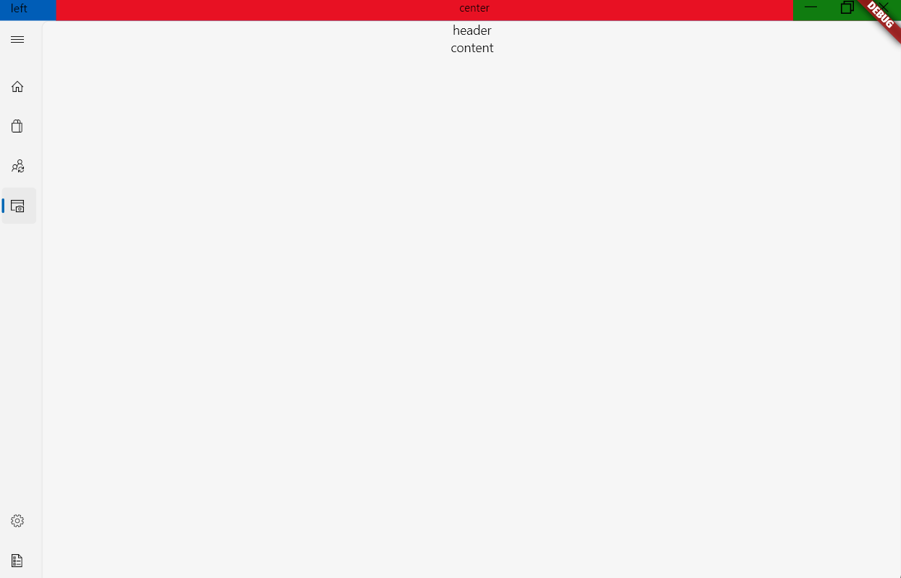
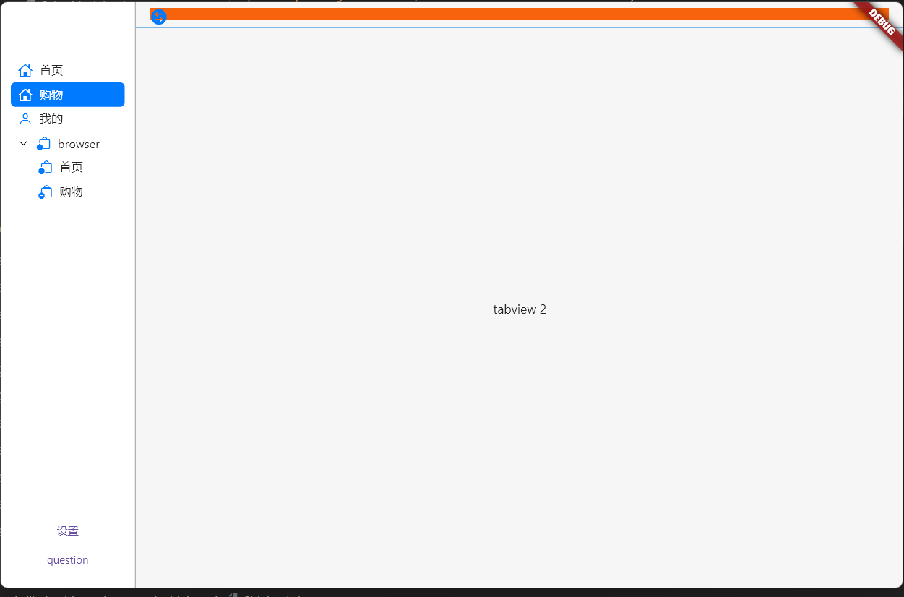
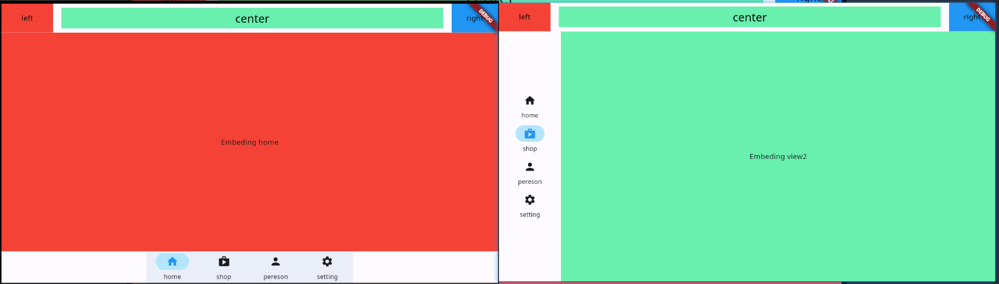
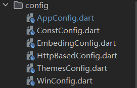
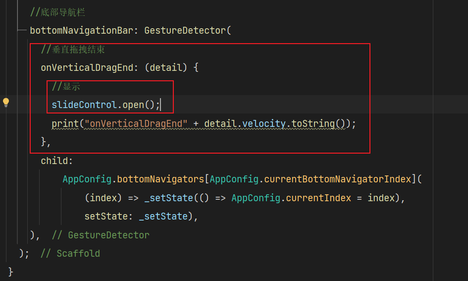

## 快速开发flutterApp的工程模版

### 提示

* 适用Android的：https://github.com/gnu-xiaosong/flutter_app_Android_template
### 文档
https://gnu-xiaosong.github.io/flutter_quaker_app/


### 项目架构

### 特性

* 统一管理器模块调度
* 统一App参数配置
* 统一组件化管理
* 统一api管理
* 统一页面化管理
* 统一App路由管理
* 统一Layous管理
* 统一状态管理
* 统一实体模型管理
* 高度可定制化，模块化
* 强解耦，强可插性
* 封装了App基本结构，开发者只需专注于页面逻辑开发。

### 适用平台

* Android
* IOS
* PC：Windows and Macos
* web
* Ipad
* Embeding嵌入式

### 使用方法

* 克隆该项目到本地

  ```dart
  git clone https://github.com/gnu-xiaosong/flutter_app_all_template.git
  ```

* 安装相关依赖:切换至项目目录命令行运行

  ```shell
  flutter pub get
  ```

  :tipping_hand_man:注意如果出现安装依赖出错，请自动修改相关依赖包以适配，后期我会进行修复。k

  **需要修改包依赖如下**：

  * **fancy_bottom_navigation:** ^0.3.2   #注意: 这个包出现问题时，要修改：用 clipBehavior: Clip.none替换为overflow: Overflow.visible
  * **bubble_bottom_bar**: ^2.0.0  #注意要解决：Badge在Badge.dart和material.dart中命名冲突问题，解决方法：隐藏掉material.dart中的Badge 即：....hide Badge

* 配置项目

​		请在项目目录中lib/config中对应配置文件配置相关平台项目参数。

* 运行启动项目

  ```shell
  flutter run -d 平台  
  ```

  或者直接运行

  ```shell
  flutter run
  ```
### 截图
* Android端

* Windows端

* Macos端

* 嵌入式端

### 开发环境

* 语言：Dart
* 框架：Flutter2

具体环境见pubspec.yaml文件

### 工程目录

```sh
├─.dart_tool
├─.idea
├─android                  ——————Android平台相关代码
├─assets                   ——————资源文件：img，font等
├─ios                      ——————IOS平台相关代码
├─lib                      ——————开发目录：flutter相关代码
│  ├─common                .........一些工具类，如通用方法类、网络接口类、保存全局变量的静态类等
│  ├─api                   .........api请求目录
│  ├─l10n                  .........国际化相关的类都在此目录下
│  ├─Layouts               .........App布局类都在此目录下
│  ├─boot                  .........各个平台启动目录
│  ├─models                .........Dart Model类会在此目录下
│  ├─config                .........配置文件目录
│  ├─pages                 .........页面存储目录：主要是构建App所需要的页面
│  ├─routes                .........存放所有路由页面类
│  ├─states                .........保存APP中需要跨组件共享的状态类
│  ├─widgets               .........APP内封装的一些Widget组件都在该目录下
│  └─main.dart             .........入口文件
├─linux                    ——————Linux平台相关代码
├─macos                    ——————MACOS平台相关代码
├─test                     ——————用于存放测试代码
├─web                      ——————Web平台相关代码
├─windows                  ——————Windows平台代码
├─analysis_options.yaml    ——————分析dart语法的文件，老项目升级成新项目有警告信息的话可以删掉此文件
└─pubspec.yaml             ——————配置文件，一般存放一些第三方库的依赖。
```

### 项目配置
在config目录下文件中配置APP相关参数。



### 更新日志：
- 2024.1.6 增加了notification本地化通知插件，并且进行了工具类封装,以及主题插件配置

- 2024.1.7 增加下拉刷新以及微光效果，修改目录结构,以及登录注册页面

- 2024.1.24 fix bottom sheet to gesture

  

- 