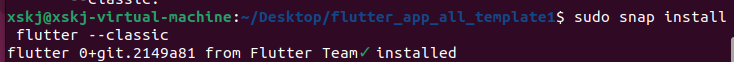
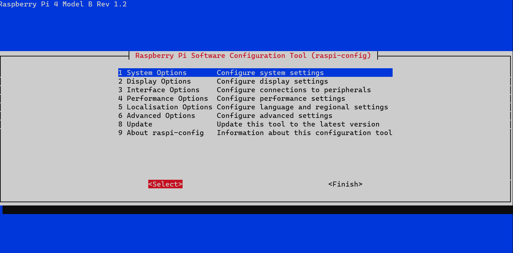
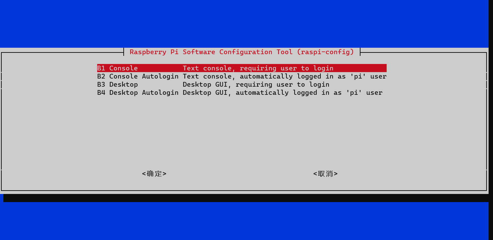
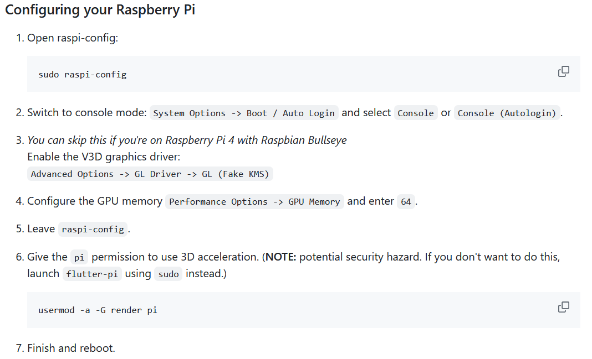
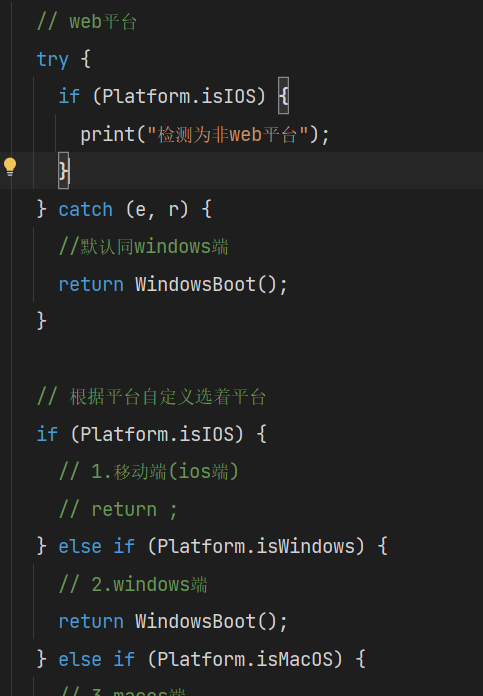
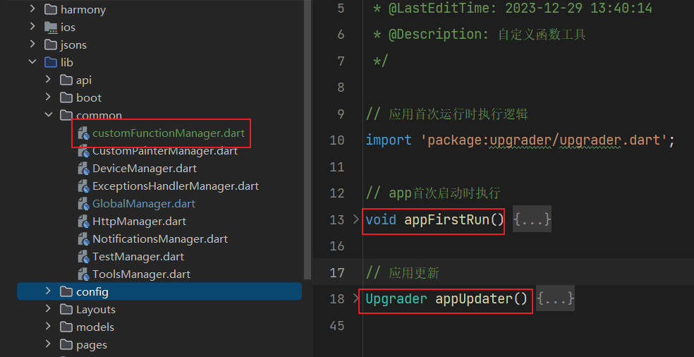
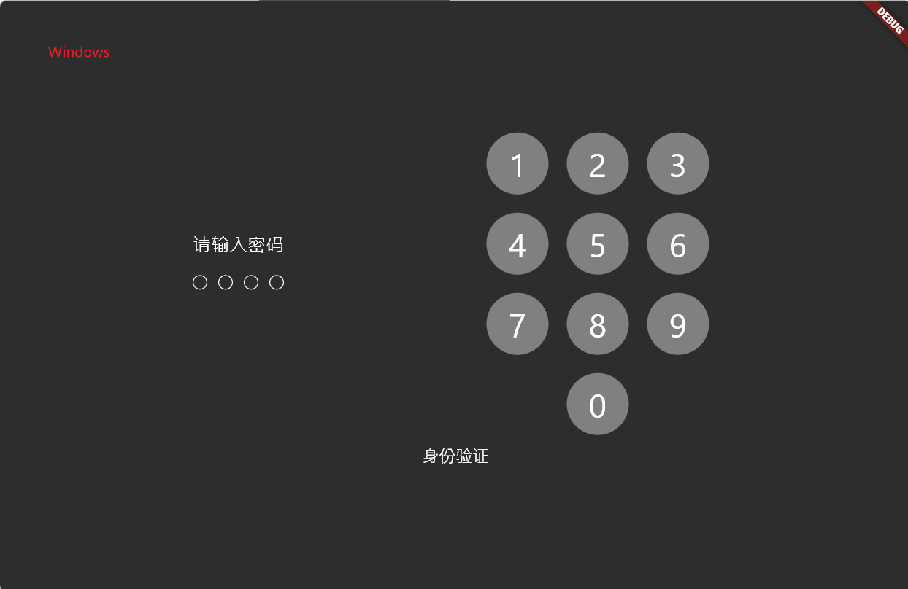
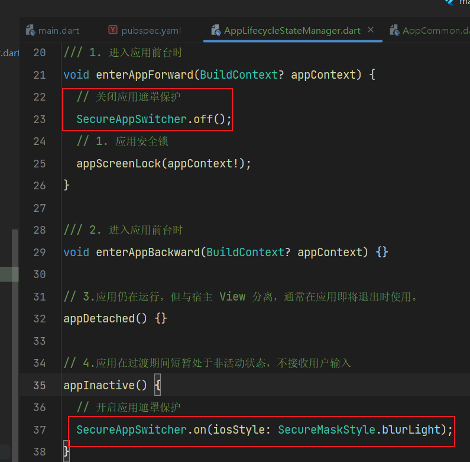

## 快速开发flutterApp的工程模版

### 目录

[TOC]

### 提示

* 适用Android的：https://github.com/gnu-xiaosong/flutter_app_Android_template
### 文档
https://gnu-xiaosong.github.io/flutter_quaker_app/


### 项目架构

### 特性

* 统一管理器模块调度
* 统一App参数配置
* 统一组件化管理
* 统一api管理
* 统一页面化管理
* 统一App路由管理
* 统一Layous管理
* 统一状态管理
* 统一实体模型管理
* 高度可定制化，模块化
* 强解耦，强可插性
* 封装了App基本结构，开发者只需专注于页面逻辑开发。

### 适用平台

* Android
* IOS
* PC：Windows and Macos
* web
* Ipad
* Embeding嵌入式

### 使用方法

* 克隆该项目到本地

  ```dart
  git clone https://github.com/gnu-xiaosong/flutter_app_all_template.git
  ```

* 安装相关依赖:切换至项目目录命令行运行

  ```shell
  flutter pub get
  ```

  :tipping_hand_man:注意如果出现安装依赖出错，请自动修改相关依赖包以适配，后期我会进行修复。k

  **需要修改包依赖如下**：

  * **fancy_bottom_navigation:** ^0.3.2   #注意: 这个包出现问题时，要修改：用 clipBehavior: Clip.none替换为overflow: Overflow.visible
  * **bubble_bottom_bar**: ^2.0.0  #注意要解决：Badge在Badge.dart和material.dart中命名冲突问题，解决方法：隐藏掉material.dart中的Badge 即：....hide Badge

* 配置项目

​		请在项目目录中lib/config中对应配置文件配置相关平台项目参数。

* 运行启动项目

  ```shell
  flutter run -d 平台  
  ```

  或者直接运行

  ```shell
  flutter run
  ```
### 截图
* Android端

* Windows端

* Macos端

* 嵌入式端

### 开发环境

* 语言：Dart
* 框架：Flutter2

具体环境见pubspec.yaml文件

### 工程目录

```sh
├─.dart_tool
├─.idea
├─android                  ——————Android平台相关代码
├─assets                   ——————资源文件：img，font等
├─ios                      ——————IOS平台相关代码
├─lib                      ——————开发目录：flutter相关代码
│  ├─common                .........一些工具、模块类，
│  ├─manager               .........app管理类,如通用方法类、网络接口类、保存全局变量的静态类等
│  ├─api                   .........api请求目录
│  ├─l10n                  .........国际化相关的类都在此目录下
│  ├─Layouts               .........App布局类都在此目录下
│  ├─boot                  .........各个平台启动目录
│  ├─models                .........Dart Model类会在此目录下
│  ├─config                .........配置文件目录
│  ├─pages                 .........页面存储目录：主要是构建App所需要的页面
│  ├─routes                .........存放所有路由页面类
│  ├─states                .........保存APP中需要跨组件共享的状态类
│  ├─widgets               .........APP内封装的一些Widget组件都在该目录下
│  └─main.dart             .........入口文件
├─linux                    ——————Linux平台相关代码
├─macos                    ——————MACOS平台相关代码
├─test                     ——————用于存放测试代码
├─web                      ——————Web平台相关代码
├─windows                  ——————Windows平台代码
├─analysis_options.yaml    ——————分析dart语法的文件，老项目升级成新项目有警告信息的话可以删掉此文件
└─pubspec.yaml             ——————配置文件，一般存放一些第三方库的依赖。
```

### 项目配置
在config目录下文件中配置APP相关参数。


### Rasperry for flutter 配置

> 提示：开发机器为windows   构建机器为ubuntu，运行机器为Raspberry

#### 第一步：安装vmware虚拟机，自行百度。ubuntu系统为例

#### 第二步：配置Flutter环境，snap进行安装flutter

地址：https://github.com/ardera/flutterpi_tool

* 安装snap工具

  官方地址：https://flutter.cn/docs/get-started/install/linux#method-1-install-flutter-using-snapd

  ```shell
  sudo apt install snap
  ```

* 安装flutter

  ```shell
  sudo snap install flutter --classic
  ```

  

* 测试flutter

  ```shell
  sudo flutter doctor -v
  ```

* 切换国内源：加快flutter访问速度

  ```sh
  export PUB_HOSTED_URL="https://pub.flutter-io.cn"
  export FLUTTER_STORAGE_BASE_URL="https://storage.flutter-io.cn"
  ```

#### 第三步：Raspberry配置

##### 安装flutter-pi工具(用于调起flutter应用)

* 安装相关依赖

  ```shell
  sudo apt install cmake libgl1-mesa-dev libgles2-mesa-dev libegl1-mesa-dev libdrm-dev libgbm-dev ttf-mscorefonts-installer fontconfig libsystemd-dev libinput-dev libudev-dev  libxkbcommon-dev
  
  sudo fc-cache
  ```

* clone源代码

  ```shell
  # github
  git clone https://github.com/ardera/flutter-pi
  # gitee
  git clone https://gitee.com/komatsu1134/flutter-pi.git
  # 切换至目录
  cd flutter-pi
  ```

* 编译代码

  ```shell
  mkdir build && cd build
  cmake ..
  make -j`nproc`
  ```

* 安装

  ```shell
  sudo make install
  ```

* 启用

  ```shell
  flutter-pi 
  ```


##### 配置Raspberry参数

* 打开raspi-config

  ```shell
  sudo raspi-config
  ```

  

* 设置boot启动为命令行模式: System Options -> Boot / Auto Login and select Console or Console (Autologin).

  

* 其他额外配置：https://github.com/ardera/flutter-pi#-building-flutter-pi-on-the-raspberry-pi

  

* 重启

  ```shell
  sudo reboot
  ```

### 第四步：启动项目

* 克隆项目

  ```shell
  # github 推荐
  git clone https://github.com/gnu-xiaosong/flutter_app_all_template.git
  # gitee  更新可能不及时
  git clone https://gitee.com/komatsu1134/flutter_app_all_template1.git
  ```

* 安装项目包依赖依赖

  ```shell
  flutter pub get
  ```

* 安装`flutterpi-tool`工具统一管理编译

  ```shell
  flutter pub add flutterpi_tool
  ```

* 激活flutterpi_tool

  ```shell
  flutter pub global activate flutterpi_tool
  ```


* 编译资源包:采用flutterpi-tool

  * `cd`进入项目目录

    ```
    cd flutter_app_all_template
    ```

  * 运行`flutterpi_tool build`编译

    * `ARM 32-bit` debug mode

      ```shell
      flutterpi_tool build
      # or
      flutter pub global run flutterpi_tool build
      ```

    * `64-bit ARM`, release mode, with a Raspberry Pi 4 tuned engine
    
      ```shell
      flutterpi_tool build --arch=arm64 --cpu=pi4 --release
      # or
      flutter pub global run flutterpi_tool build --arch=arm64 --cpu=pi4 --release
      ```
      
      > 注意：要将flutterpi_tool添加进环境变量中
      >
      > ```shell
      > export PATH="$PATH:`pwd`/xxx/bin"
      > ```

* **发送打包资源**给Raspberry：使用`rsync`或`scp`将捆绑包部署到Raspberry Pi

  ```shell
  # cd进入项目目录
  cd flutter_app_all_template
  # 使用rsync
  rsync -a --info=progress2 ./build/flutter_assets/ pi@raspberrypi:/home/pi/my_apps_flutter_assets
  # 或scp
  scp -r ./build/flutter_assets/ pi@raspberrypi:/home/pi/my_apps_flutter_assets
  ```

  > 如果连接不上则，用ip连接pi@raspberrypi
  >
  > 注意：只需要将树莓派连接到同一个局域网内即可，运行该命令之后他会提示你输入密码，用于传输数据至树莓派

* Raspebrry端**启动项目**：在Raspberry中执行

  ```sh
  sudo flutter-pi --release /home/pi/my_apps_flutter_assets
  ```

### 更新日志：

- 2024.1.6 增加了notification本地化通知插件，并且进行了工具类封装,以及主题插件配置

- 2024.1.7 增加下拉刷新以及微光效果，修改目录结构,以及登录注册页面

- 2024.1.24 fix bottom sheet to gesture

  

- 2024.1.28 add flutter embeding to Raspberry and exception catched handler

- 2024.3.3  修复bottom底部样式9的bug以及垂直滑动弹窗点击和水平滑动时也弹出的bug

- 2024.6.4  google_fonts bug修复

  - 方法一: 指定google_fonts版本为6.1.0   默认方法

    

  - 方法二: 使用google_fonts 版本为6.2.1，则需要将flutter版本更新为>=3.19.2
  
- 2024.6.4 修复平台检测代码

  

* 2024.6.5 增加应用首次加载、应用更新(利用包[upgrader](https://pub.dev/packages/upgrader))监测。

  

* 2024.6.7 增加app生命周期钩子函数【AppLifecycleStateManager.dart】、增加应用安全锁【配置在AppCommon.dart文件中】、修改common目录名为manager名、并保留common作为扩展目录。

  [1] 安全锁支持指纹等方式，，采用local_auth包作为生物验证包。同时支持密码锁，初始密码为1234。

  [2] ！！！！存在指纹解锁bug，待解决

  

* 2024.6.7  添加应用用户离开应用程序时，在应用程序中隐藏内容的安全性可见性。包[secure_app_switcher](https://pub.dev/packages/secure_app_switcher)

  

